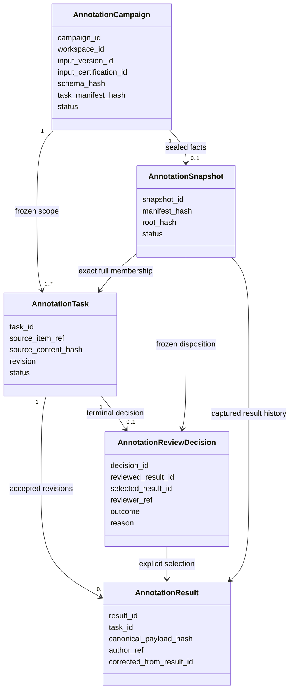
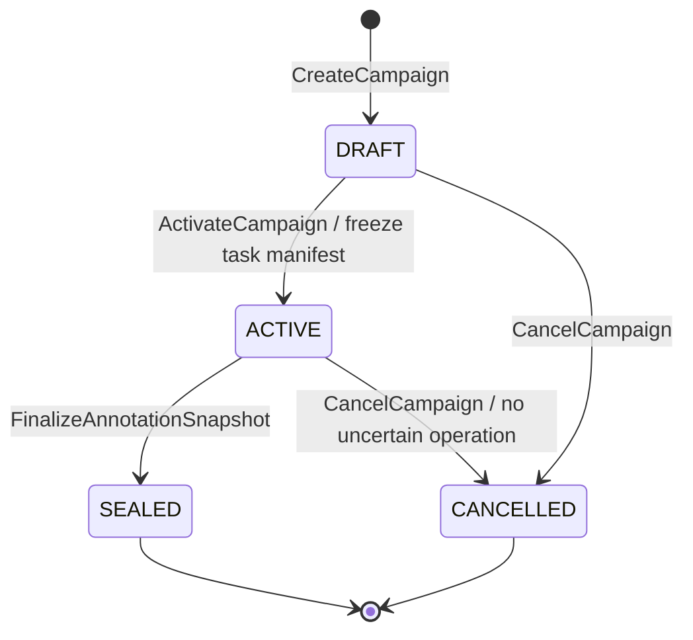
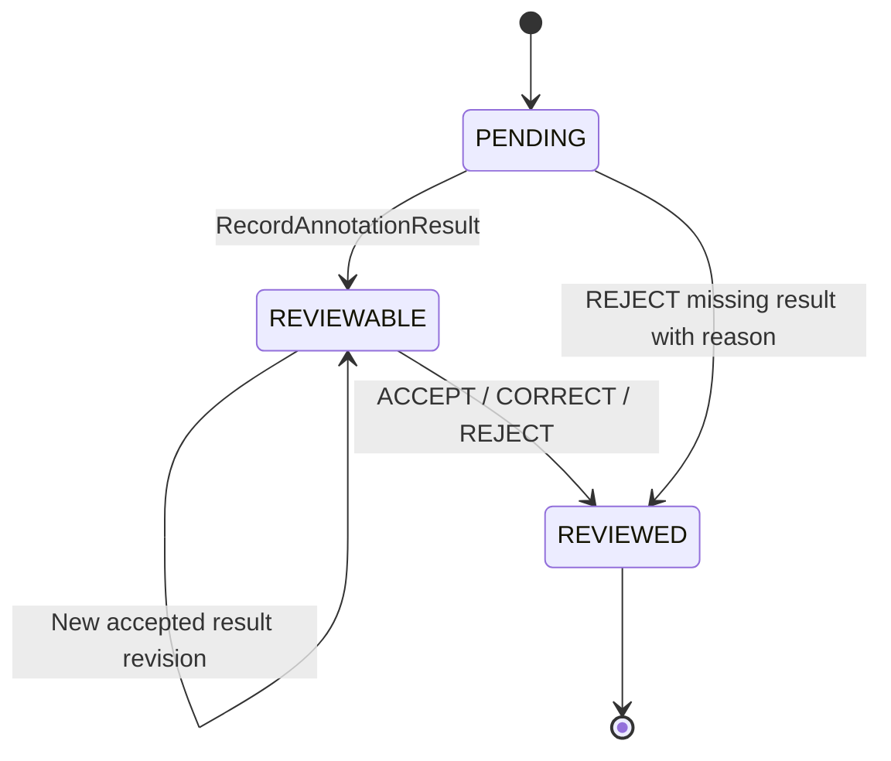
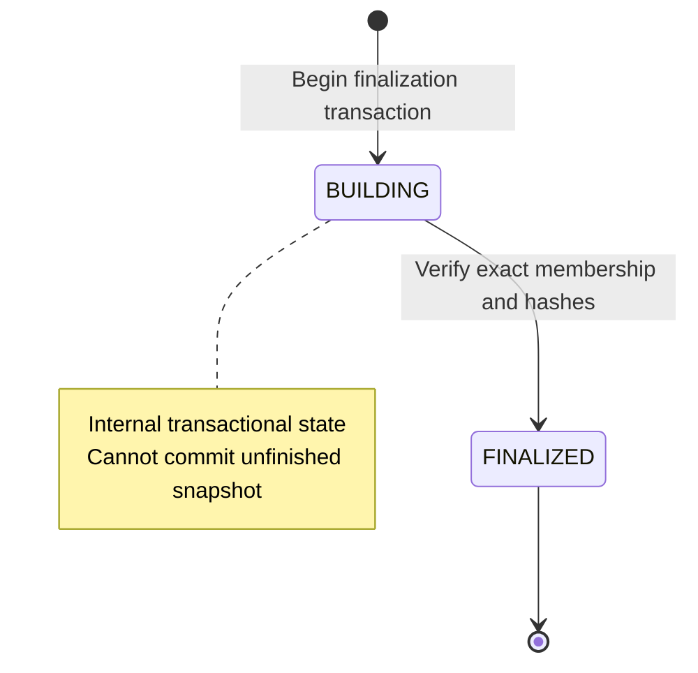

# Annotation Domain：事实、审核与冻结契约

> 状态：#209 设计基线，合并后约束 #204/#206；本文件不表示代码已经实现。
> 产品范围见 [Gold Dataset](../product/gold-dataset.md)，外部协议见 [Engine integration](annotation-engine-integration.md)，下游绑定见 [Gold production](gold-dataset-production.md)。

## 1. Aggregate 和权威边界

Campaign 是本轮小规模生产的协调 aggregate；Task 是有独立 identity/revision 的工作项，不是 Label Studio task 的镜像。Result、ReviewDecision 是 append-only facts。Snapshot 是一次原子建立并 FINALIZED 的独立 immutable aggregate。

上述字段是语义契约，不是本 PR 的 migration 或 HTTP schema。Core ID、workspace、状态、版本、结果选择、贡献资源与生产关系必须强类型可查询；允许受 schema 约束的标注 payload，但不能把权威身份、授权或 membership 藏入任意 JSON。

## 2. Campaign、任务全集与生命周期

CreateCampaign 冻结 input DatasetVersion、explicit input certification、用途、目标使用/交付上下文、annotation contribution DataResource、标注 schema/taxonomy、rubric、renderer、审核 policy 的版本、规范化内容与 hash。引用可变文件路径或外部配置 ID 不足以冻结规范。后续修改这些语义创建新 Campaign，不在原 Campaign 上编辑。

Pilot 的 input 是一个 exact immutable version，范围为其全部记录；source item 使用 `input_version_id + 稳定行定位 + 原行内容 hash`，不使用 provider list 顺序或可重复的公司名。重复行也必须保有不同稳定位置，不能因内容 hash 相同合并任务。Task identity 与 source item 的绑定一旦建立不得改连。

CreateTasks 只允许 DRAFT。ActivateCampaign 在同一事务锁内验证 input bytes/checksum、完整 source membership、非空数量上限、schema/rubric/renderer、任务文本 hash 和当前处理权限，冻结完整 task manifest 后进入 ACTIVE。激活后禁止增删/替换 Task、变更输入、标签定义或缩小分母。

SEALED 与 snapshot FINALIZED 同事务产生；不允许仅改 Campaign status 假装冻结完成。CANCELLED 停止后续业务处理，不删除历史、不证明引擎中副本已删除；有仍可能完成的外部提交时不能声称取消已收敛。Pilot 不支持 reopen，修正封存结果或审核结论用新 Campaign，可记录 replacement_of 供解释，但不自动使旧输出认证失效。

Task 的 REVIEWED 是处理终态，不代表标签通过。REJECT 与 ACCEPT/CORRECT 通过 decision.outcome 区分。缺失结果可由 reviewer 显式 REJECT，不能自动改为通过；仍为 UNKNOWN 的外部提交必须先处置，不能靠 REJECT 隐藏它。

## 3. Result identity 与外部修订

Pilot 接受一个主标注者的多次结果修订；多个不同主标注者的竞争结果不自动投票或挑最新，保留为待处置的 provider observation。主标注者在激活的 task policy 中固定，provider actor 必须经可信 adapter binding 映射，不能由客户端自报。

RecordAnnotationResult 只在 ACTIVE 且 Task 尚未 REVIEWED 时接纳 schema-valid、已提交、非取消的结果。每次接纳生成新的 immutable Result，提升 Task revision。原始 observation、规范化 payload、adapter normalizer version、input/task/schema 身份和 hash 都可追溯；draft、prediction、取消或畸形结果不成为可选的合格 Result。

外部同一 annotation 被修改，不 UPDATE 旧 Result。去重 identity 至少含 provider instance/binding、external task/annotation ID 和规范化内容 hash；provider revision 若存在一并留证，但不能只信 timestamp。不同外部 annotation ID 即便标签相同也是不同来源，不能仅凭 label hash 合并。重复回收完全相同事实返回原 Result；同 observation key 携带冲突内容时隔离报错。

REVIEWED/SEALED 之后到达的新外部内容只记 integration observation，不再改变该 Task 的候选集合、终态决定或快照。Core 不声称能重建尚未回收就已被 provider 覆盖/删除的历史。

## 4. ReviewDecision 与唯一 authoritative result

ReviewAnnotation 请求必须带 task identity、expected task revision、reviewed_result_id（没有可用结果的 REJECT 可为空）、action、mandatory reason 和幂等键。reviewer 来自服务端已认证 principal 的当前 workspace/role binding，不接受 body/header 中的 actor 自证。

Pilot reviewer 必须不同于该 Task 的主标注者。CORRECT 由 reviewer 创作修订，不要求第三人再审；它明确记录为 reviewer correction，不冒充独立的第二次原始标注。

| 动作 | 原子事实及输出权威性 |
| --- | --- |
| ACCEPT | 保存 Decision；selected_result_id=reviewed_result_id，所选 Result 必须属于该 task/input/schema 且有效 |
| REJECT | 保存 Decision 和原因；selected_result_id=NULL；可保留 reviewed_result_id，不产生输出标签 |
| CORRECT | 创建 schema-valid immutable Result，corrected_from 指向原 Result；同事务保存 Decision 指向新 Result，并保留原输入/原作者/审核者 |

一个 Task 在 Pilot 只允许一个成功的终态 Decision。Task 的 current_decision_id 如有只是指向这个事实的 projection；DB 唯一约束和 expected-revision CAS 都要保护它。禁止按最大 created_at、provider ground_truth、provider reviewed 标志或“存在过 ACCEPT”决定权威结果。

两个 reviewer 竞争：持同一 Task revision 的第一个事务成功；后者冲突时不得留下 correction Result、Decision 或 current projection 等看起来已生效的业务事实，但**真实已经发生的人工审核 activity 不能被事务回滚吞掉**。每次 reviewer 实际提交审核都使用独立稳定 activity identity；若 CAS 失败，则记录 non-success review-attempt Cost fact（并可附 Audit/Evidence observation），明确 outcome=STALE_CONFLICT/等价失败结果，不得伪装为成功 Decision。UI 展示冲突并要求重新读取，不自动改 revision 重试。相同幂等键、相同规范化请求只返回已有事实；同一 physical review attempt 的网络/事务重放不得重复计费；新的真实人工尝试使用新的 activity identity。相同键不同语义冲突。身份和访问授权必须先验证，幂等命中不泄漏别的 workspace 的结果。

结果回收与审核也共享 revision：回收先提交则旧审核冲突；审核先提交则后到 provider 内容只成为 observation。错误的已终态审核不能覆写，Pilot 通过新 Campaign 重新审核；旧认证是否退出 current set，必须另走显式 CertificationDisposition，不隐式级联重写。

## 5. AnnotationSnapshot 精确冻结契约

Snapshot 不等于“选中标签的导出文件”，也不等于 Label Studio 的 export snapshot。它冻结一次 Core 业务事实截面。

Header 至少包括 workspace/campaign、input version/checksum、input certification reference、task manifest identity/hash、schema/taxonomy/rubric/renderer/review policy 内容与 hash、annotation contribution resource、构建时间/actor、格式版本及 manifest/root hash。

Membership 必须精确覆盖：

- 激活 manifest 中的全部 Task/source item/input-text hash；
- 每个 Task 被 Core 接纳的全部 Result identity/hash/author/provenance，包括 CORRECT 的原结果和新结果；
- 每个 Task 唯一的终态 Decision、reviewed/selected/corrected 关系、reviewer、reason；
- ACCEPT / CORRECT / REJECT 的 disposition，包括没有标签的 REJECT；
- expected task/result/decision counts 和输出允许成员集合。

不能把失败任务从 manifest 移除；manifest Task set 与激活时 Task set 必须双向相等。尚有 PENDING/REVIEWABLE、未处置的 uncertain submit、跨 task selection 或未验证 payload 时，Finalize 必须失败。全部终态中包含 REJECT 可以 seal，但下游质量分母仍含它，不能获得本 Pilot 的 Gold PASS。

本 Pilot 采用单事务 seal：创建 BUILDING、写全部成员、复核 exact set/count/content、计算 root、转 FINALIZED、Campaign 转 SEALED、Audit/Evidence/Outbox 一次提交。失败全部回滚，禁止 direct FINALIZED insert，禁止 BUILDING 提交。FINALIZED 后 header 和 membership 的 INSERT/UPDATE/DELETE 均 fail closed；有历史事实的 destructive rollback 同样不能重新开放写入口。

Hash 使用有格式版本、确定编码、确定 key/成员排序、显式 null/空集合语义的规范化 manifest。root 覆盖 header 的业务内容与精确 membership（不包含 root 自身）；只 hash 数量、当前查询 JSON 或外部 URL 不足够。实现复用已存在的 canonicalization/hash 方法，并为该固定格式提供 golden vectors。seal 时在 DB 中验证保存的 payload/hash 与 persisted membership；读时提供 integrity verification，不能只相信存下的 root。

Snapshot 必须保留可验证的 payload 本体或 Core-controlled immutable object identity，不只留 hash。对象 missing/hash mismatch 导致读/构建 fail closed；保留 hash 本身不等于可恢复内容。禁止以 soft delete 修正历史；在该 Pilot 中不做自动清除被 snapshot/output/certification 引用的对象。

## 6. Command、事务、锁与幂等

| Command | 幂等/冲突边界 | 事务结果 |
| --- | --- | --- |
| CreateCampaign | workspace+command key+canonical fingerprint | 同键同语义一个 Campaign |
| CreateTasks | campaign+source item；另校验 payload fingerprint | 不重复任务、不重连 source |
| ActivateCampaign | expected Campaign revision/status | 原子冻结 task manifest |
| RecordAnnotationResult | 完整 provider observation identity + hash；Task CAS | 新 Result 与 revision 同事务 |
| ReviewAnnotation | command key + fingerprint、expected Task revision、唯一 terminal Decision | correction/decision/projection/Audit 原子化 |
| FinalizeAnnotationSnapshot | campaign 唯一 snapshot + command fingerprint | snapshot 和 Campaign 原子 seal |
| CancelCampaign | expected state/revision | 明确取消事实，不能覆盖历史 |

固定锁序：需要当前权限 fence 的路径先取现有 workspace authorization/delivery fence；之后 Campaign parent → 按 Core ID 排序的 Task parents → Snapshot parent。每一种 accepted Result、Review、Task membership mutation 都先获取 Campaign parent 并检查状态，再取 Task；snapshot member 写入取同一 Snapshot parent。不得先锁 Task 再回头锁 Campaign。

Finalize 在上述锁内重读完整事实，不使用事务外 preflight 作为提交依据。append-only/FINALIZED guards 必须在 DB 直接 INSERT/UPDATE/DELETE 下也生效；只有应用判断或无锁 trigger 不足以防止 late writer 穿越 seal。远程 HTTP、读取大对象、人工等待均不得放在这些锁内；先准备和校验不可变内容，再在短事务核对 identity/hash/revision。

并发验收至少覆盖：result-first/review-first、review-first/seal-first、membership-first/finalize-first、double finalizer、same-key conflicting payload、wrong-workspace、direct-final insert、unfinished BUILDING commit 和 finalized tamper。seal-first 后新 mutation 拒绝；writer-first 时 finalizer 看到其完整结果或明确阻断，不允许半个 correction 入快照。

## 7. 复用、Evidence、Cost 和 #111

沿用现有 Outbox、worker、Evidence/Audit、CostEvent/typed CostAllocation；不建第二套队列或通用审核引擎。所有关键业务 Command 的事实、Audit、Evidence 和事件入 Outbox 同事务；新增事件需声明 required handlers 或 retention-only。

审核成本按**真实发生的 human review physical attempt** 记账，而不是只按成功 Decision 记账：成功审核产生成功 outcome 的 review activity Cost fact；已经实际完成工作但因 expected-revision/CAS 竞争失败的审核，也必须以独立稳定 activity identity 保留 non-success outcome 成本事实。业务 Decision/correction/projection 可以回滚，真实劳动成本不能静默丢失。same-attempt 的命令/网络/事务重放未产生新人工工作时去重；新的真实人工重试使用新的 activity identity。失败 CAS 绝不能伪造成成功审核。实际外部调用成本同样按独立 physical attempt 保留，含失败、unknown 和 reconcile，不被 Campaign 顶层幂等吞掉。金额未知只记录可信 quantity/unit；不从缺失 duration 编造费用。

#111 可复用可信 reviewer 解析、mandatory reason、expected-revision CAS、不可变 decision 与审计写法。但 Entity selection 和 Annotation label review 的对象、允许选项、状态机不同；#111 不成为前置依赖，不抽一个万能 ReviewTask/BPMN aggregate。

## 8. 验收与实现边界

#204 实现模型、task manifest、结果/决定事务约束、snapshot exact freeze 和 DB/HTTP 负例；#206 增加用户审核操作与质量读取，不能在该阶段再发明一套审核终态。#205 只通过这些 Core acceptance Commands 接纳外部事实。#207 消费 FINALIZED snapshot，不回读 provider current state。

本文件给出实施 contract，不预先提供全部表/API、更不宣称并发测试已通过。性能分片、多主标注者、仲裁、多轮 reopen、自动 retention 等只有真实场景要求时另立 Issue。
