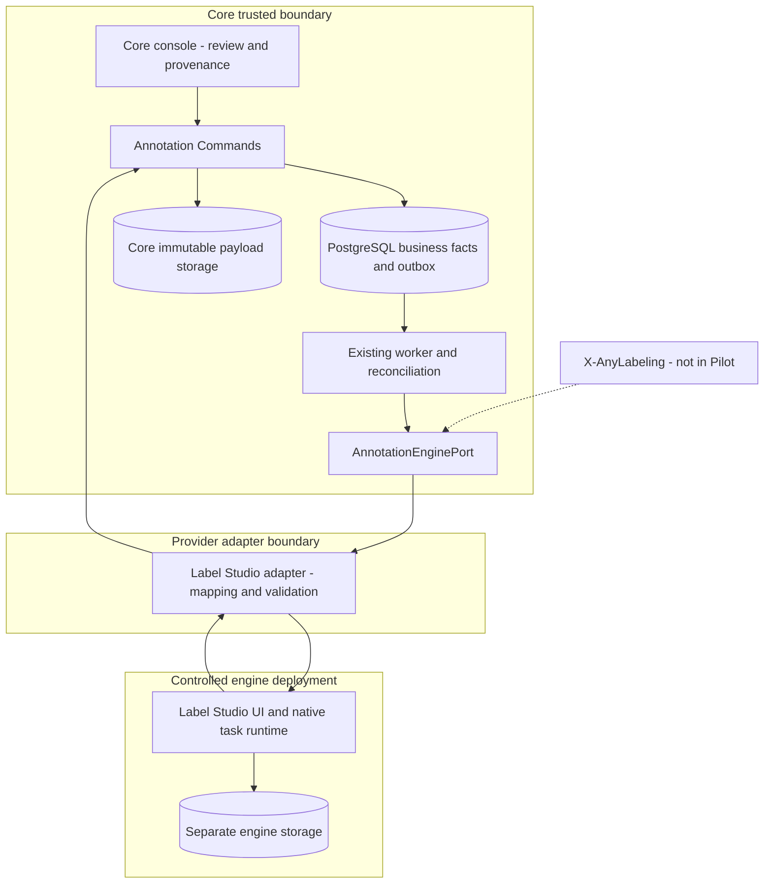

# Annotation Engine：Core / Label Studio 集成边界

> 状态：#209 设计基线；实现归 #205，真实部署/故障注入证据在 #208。
> 产品范围：[Gold Dataset](../product/gold-dataset.md)。Core acceptance：[Annotation Domain](annotation-domain.md)。

## 1. 能力归属与部署边界

Label Studio 是标注执行工具，不是 Annotation/Gold 业务事实的 System of Record。Core 不能通过读外部 current state 重新解释已冻结历史。



Core 保存 Campaign/input/schema/rubric/task identity、接纳结果、审核决定、冻结快照、生产/权利依赖、Cost/Evidence/Audit。Engine 保存 UI 草稿、标注交互、原生任务队列/分配及运行时状态。Adapter 保存连接、外部绑定、原始 observation 引用和映射版本；其私有扩展字段不成为 Core 领域列或业务权威。

复用现有 worker/outbox/reconciler，不增第二套 scheduler。Core 只负责业务提交/接纳与不确定结果恢复，不复制 Label Studio 的 workforce、通用任务分发或标注画布。

## 2. Build-vs-Buy / Reuse Check

仓库已有 dataset/storage/worker/quality/rights/certification，但没有通用标注交互；自研标注画布和任务队列不形成此产品的差异化价值。Core 新增的审核权威性、冻结事实和认证绑定则不能交给 provider，否则外部编辑会改写 Gold 历史。

第一 adapter 使用 Label Studio Community 原生 API 和标注 UI，不 fork、不依赖 Enterprise 审核能力。官方提供导入、标注和结果导出接口，适合本次小规模文本单标签场景；Core 自己的 review 是对交付证据的领域接纳，不是再造一套标注 SaaS。[S1][S2][S3]

上游 LICENSE 为 Apache-2.0；#205 必须固定实际测试的 release/tag 与容器 digest，记录依赖许可及部署检查，不能用 latest 镜像声称已验证。维护评估依据上游 release history；本设计不把更新频率承诺为长期 SLA。[S4][S5]

运维增加一个有持久化数据、账号和服务凭证的 engine，采用受控本地部署和合成数据；其 DB 与 Core 分离。替换成本限定在 Adapter、external bindings 与迁移导出；Core 已接纳事实不依赖继续运行该 engine。

X-AnyLabeling 是未来候选，不创建空 adapter。只有明确 CV/离线自动标注场景无法由当前实现满足时，才评估其接口、许可、维护、持久化结果格式和相同 acceptance contract；本轮不因为已有第二个产品名称而扩大 Port。

## 3. 最小 Port 和稳定身份

Port 只定义本 Pilot 需要的语义操作，不照抄 SDK：

| 能力 | 输入与权威输出 |
| --- | --- |
| EnsureCampaignBinding | Core campaign/request identity、冻结配置 hash；返回已验证的 provider binding 或 uncertain outcome |
| SubmitTasks | 完整固定 Task/input payload identities；返回 observation，不直接标记任务审核通过 |
| LookupSubmission | 同一 request identity；返回 MATCHED / ABSENT_PROVEN / UNKNOWN / CONFLICT |
| FetchResults | 已验证 project/task binding 和有界分页位置；返回未接纳的结果 observations |

project/task/result external IDs 必须以 `provider instance + workspace-owned connection + binding + external ID` 定位，不能仅依赖数字 ID。request fingerprint 覆盖 Core campaign/task identity、输入 hash、schema/config hash、operation kind 与目标 provider instance；与每次真正 HTTP 调用的 physical_attempt_id 分离。

Label Studio 同步导入可请求返回 task IDs，但该选项不是幂等保证；Community 与非 Community 的同步/异步导入行为也不同。#205 必须按固定 edition/tag 验证响应，不能假设拿到 import_id 就表示全部任务已创建。[S1]

## 4. DB-first 提交与 unknown outcome

本基线**不假设 Label Studio 提供原生 Idempotency-Key 或 exactly-once create**。官方导入说明不能作为该保证。默认采用安全优先的窄协议：

1. Core 先在 DB 中保存 operation identity/fingerprint、冻结任务集合、outbox 和不可变 attempt start；同一 operation 只允许一个 dispatcher 获得提交权。
2. 提交前做当前权限与 frozen payload 校验。Adapter 为 project/task 写入可查询的关联标记，包含 Core request/task identity 和 payload/config hash；标记只辅助查找，不能替代服务端验证。具体字段归 adapter，并在固定版本上做 contract test。
3. 保存 SENDING/dispatch claim 后才允许 HTTP；不跨 HTTP 持 DB 行锁。worker 重启、lease 过期或传输失败后，已经可能发出的 operation 只能进入 UNKNOWN，不重新退回“尚未发送”。
4. 正常响应必须经 read-after-write 核对完整 task IDs、标记、输入及配置；request 同步成功不等于 payload 正确，也不等于 Core Result/Review 完成。
5. timeout、连接中断、无明确副作用保证的 5xx、发送后进程 crash 均视为 UNKNOWN。只有确定未发送，或 provider 明确保证没有任何 side effect 的拒绝才可记 definite reject；批量部分成功不能标作全批失败。
6. UNKNOWN 只允许 LookupSubmission/reconcile，不直接再 POST。匹配唯一且完整时 adopt 原 project/tasks；有重复或内容冲突则 CONFLICT 并阻止接纳，禁止任意选第一个。部分匹配先冻结已观察集合，未证明不存在的任务不得重发。
7. 查询必须完成该 operation 相关的全部分页并验证权限/一致性，单页/过滤列表为空不是 ABSENT_PROVEN。没有权威终态及“不再有在途请求”的证据时，零匹配只能 UNKNOWN。有限重试后进入显式人工处置，不承诺自动终结一切不确定性。
8. 只有证明旧请求未产生且不会再产生 side effect，才能通过显式恢复 Command 记录证据并发起新的 physical attempt；不能通过换 request key、删 Core 记录或重建 Campaign 规避未知操作。原 attempt/observation 永久保留。

这个协议承诺 Core 不重复创建同一 Task/Result，且不因不确定性盲目重复远端创建；**不承诺在缺少 provider 支持时既自动无限恢复又保证远端 exactly-once**。无法提供关联查找能力的 engine/version 不通过 adapter contract，不能用随机项目名重试替代。

```mermaid
sequenceDiagram
    participant C as Core command
    participant D as Core DB
    participant W as Worker/Adapter
    participant L as Label Studio
    C->>D: operation + task manifest + outbox
    D-->>C: commit
    W->>D: claim + attempt start + SENDING
    D-->>W: commit
    W->>L: one controlled submit with correlation
    alt response available
        L-->>W: provider identifiers
        W->>L: verify project/tasks/config
        W->>D: append observation + verified bindings
    else response lost or worker crashed
        W->>D: append UNKNOWN observation on recovery
        W->>L: lookup same request identity
        alt unique exact match
            W->>D: adopt original bindings
        else absence not provable or conflicting matches
            W->>D: preserve UNKNOWN/CONFLICT; no new POST
        end
    end
```

成本按真正 physical invocation 记录：submit、lookup、fetch 各自的稳定 attempt；重放已有 observation 不新增调用成本。timeout 不得删除已发生调用的成本，后续 resolution 也不覆盖最初观察。复用 [Outbox/幂等基线](outbox-delivery-and-idempotency.md)，不要另造通用 durable runtime。

## 5. 回收、修订与历史解释

Pilot 以持凭证的服务端 pull 为权威回收方式，webhook 不作为必需链路。未来 callback 最多触发已知 binding 的 pull；未经验证的 body 不直接写 Core Result，不接受任意 provider URL 或 workspace。

Adapter 检查 provider instance、project/task binding、Core source identity/input hash、冻结 label config、作者绑定、提交/取消状态和 schema；再把规范化结果交给 RecordAnnotationResult。只有真实 submitted annotation 可参与审核，draft/prediction/cancelled 不行。官方导出可能包含取消任务，不能把“export 中有一行”当作通过。[S2]

Provider timestamp 不决定 Core authoritative result。新的外部修订成为新 observation，未审核 Task 的有效修订经 Command 接纳；已审核/封存 Task 按 [Domain §3–4](annotation-domain.md) 保持不变。不得因删除外部 task/project 就级联删除 Core facts。

历史解释依赖 Core 已接纳的 canonical payload、原始 observation 的受控 immutable copy/hash、来源身份及规范版本。对尚未回收就被删除的数据明确记录 unavailable，不编造旧 Result；如果生成 Gold 必需的结果缺失，阻断或显式 REJECT 后让 Gold quality 失败。Provider ground_truth 标志不是 Core review 或 Gold certification。

## 6. 数据暴露、身份和授权

本 Pilot 只允许受控 engine、固定 workspace-owned connection、合成数据、已验证主标注者账号与独立 Core reviewer。服务凭证只在 server-side secret configuration 中引用，不进入业务 facts、日志、浏览器 URL 或 Git。

导出 task 文本、renderer 读取输入、重试发送和 Gold build 都是实际数据使用，必须先从可信 principal 解析 effective consumer，并验证当前 source 使用/处理权限及 Contract 的目的/范围。要把数据交给 engine 的处理方，所选 Rights/Contract 必须明确覆盖该受控处理边界；READ 或历史 CERTIFIED 本身不推导出任意外发许可。

发送前在现有 workspace authorization fence 下记录 fresh processing authorization decision 和确切 payload/consumer/context，commit 后才释放数据，不能用激活时的旧 preflight。该提交定义处理授权的线性化点；稍后的撤销阻断所有新发送/重新发送/构建/交付，不能声称能收回已经交给 engine 的字节。Pilot 不保证远端副本撤回，因此不得扩为真实敏感数据或公网服务。所有恢复动作若实际重新发送内容，必须重新授权。

已有 COPY 内容的历史审核/证据保留与新数据使用是不同动作；Core 仍需校验当前 reviewer 对 workspace/task 的访问权，不以 provider completed_by 或可伪造的 body actor 认证。输入、reason 和 provider diagnostic 在 UI 以文本呈现，避免插入未清洗 HTML。连接 endpoint、项目链接必须由受控配置构造，不信任返回的任意 URL。

## 7. #205 / #208 必须提供的证据

Fake adapter contract 与真实 Label Studio slice 都必须验证：project 创建和 task 导入的 response-loss；worker 在发送前后 crash；唯一匹配恢复；分页/部分匹配；零匹配但仍 UNKNOWN；重复 project/task 冲突；重复/修改/取消结果；错误 workspace/actor/input/config；封存后远端修改与删除不改历史；授权撤销阻断新发送；失败/unknown/reconcile 成本不丢失。

最小能力矩阵须记录 edition、tag/digest、配置读回、关联标记持久化/查询、分页完整性、结果格式与作者字段。验证失败是 #205 的具体 blocker，不通过增加空接口掩盖。#209 仅冻结这个验证契约，不把未运行的 adapter tests 写成 PASS。

## 8. 官方依据

查阅日期：2026-09-23；这些资料证明 API/产品能力，不证明本仓库已完成集成。实现以固定版本的测试结果为准。

- [S1：Import tasks API](https://api.labelstud.io/api-reference/api-reference/projects/import-tasks)
- [S2：Export annotations 与原生 JSON 语义](https://labelstud.io/guide/export.html)
- [S3：Community / Enterprise 能力对比](https://labelstud.io/guide/label_studio_compare)
- [S4：上游 LICENSE](https://github.com/HumanSignal/label-studio/blob/develop/LICENSE)
- [S5：上游 Release history](https://github.com/HumanSignal/label-studio/releases)
