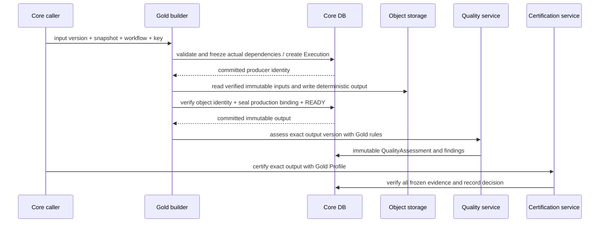
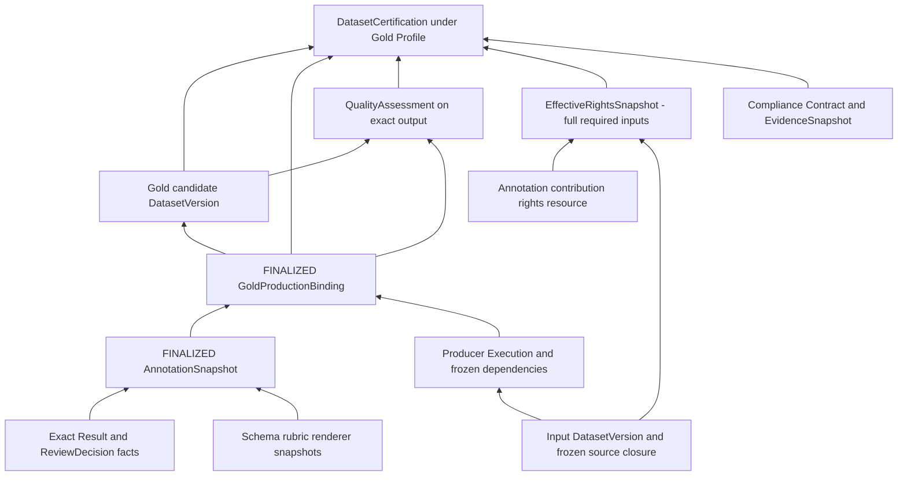

# Gold Dataset 生产、权利、认证与交付

> 状态：#209 设计基线；主要实现归 #207，评测器归 #206，纵向验收归 #208。
> 前置：[产品范围](../product/gold-dataset.md)、[Annotation Domain](annotation-domain.md)、[Engine integration](annotation-engine-integration.md)。

## 1. 复用基线和新增范围

继续使用 Dataset/DatasetVersion、Workflow/Execution、producer identity、对象存储、QualityAssessment、Rights/EffectiveRights、DatasetCertification、Evidence/Cost/Audit 和 DIRECT_DATA。不创建 GoldDataset aggregate、Gold 专属 Delivery service 或第二套认证引擎。

新增的是 AnnotationSnapshot 与实际输出之间的**强类型、不可变生产绑定**及 Gold Profile 需要的证明。不能把“复用现有机制”理解为只加一个 label 字段、只复制 input certification，或仅往 metadata JSON 写几个 ID。

当前 #202 的 lineage freeze 边界是 ProductRelease publication；它不是所有 standalone Certified DatasetVersion 的天然冻结边界。Gold 可不经 ProductRelease 交付，因此本设计明确要求 Gold 生产绑定自己的冻结输入闭包，不能等待将来发布 ProductRelease 才保护历史。

## 2. Builder 的输入、输出与幂等

BuildGoldDataset Command 必须指定 exact input DatasetVersion、explicit input certification、FINALIZED AnnotationSnapshot、目标 Dataset、冻结 builder WorkflowVersion 及幂等键。schema/taxonomy/rubric/renderer 来自 Snapshot，不接受调用方以另一版本替换。

输入必须在同一 workspace，snapshot.input_version 必须完全匹配，Snapshot integrity valid，所有必需对象/来源证明可读取并校验。输入版本当前不可用、认证/用途不覆盖或处理权利无效时不开始构建；preflight 不是实际读取/提交时的授权。

输出是目标 Dataset 下新的 immutable DatasetVersion。Pilot 使用独立逻辑目标 Dataset，避免改变输入 Dataset 的 current version；不创建独立 Gold 类型的主实体或新 DatasetVersion 生命周期。复用既有 CREATED/PROCESSING/READY 与故障恢复语义，READY 只表示内容与生产事实可用，不表示 Gold 认证通过。

输出内容由 source item 顺序确定：每个 ACCEPT/CORRECT Task 导出一行，包含输入 item reference、必要原字段、选定标签、selected result/decision reference。REJECT 不导出标签，但完整排除原因与分母保存在 Snapshot/production manifest；禁止静默填默认标签。bytes、schema、行顺序、空值/数字表示由固定 builder version 决定；不引入 wall-clock 随机字段造成重试内容漂移。

使用既有 Execution 幂等 Create/Retry 与单 producer live output 约束。同一 build request 的同键同语义返回原 Execution/output；同键换 snapshot/input/workflow 冲突。不同真实生产 Execution 不是同一次物理重放，其成本不能合并。READY output 已存在而 Execution 尚 RUNNING 时采用原 output 完成恢复，不再次生成版本；未完成对象使用同一 producer identity 恢复并验证 checksum。



网络/对象存储不假装与 PostgreSQL 同事务；中间失败保留可恢复事实。暂存对象不能经下载 API 暴露。内容缺失/hash 不符、binding 未完成或生产终态不一致时拒绝消费。

## 3. 强类型生产绑定与 standalone 冻结闭包

`GoldProductionBinding` 是此文的概念名称，表示输出生产证明，不是另一套数据集 aggregate。#207 必须实现可查询的 output version/Execution/input version/snapshot/schema 关联以及不可变成员约束，表名由实现确定。

绑定至少包含：

| 事实 | 必需内容 |
| --- | --- |
| Producer | exact Execution、WorkflowVersion 和实际 input dependency identities |
| Source | input version/checksum、创建时选择的 input certification、其冻结生产/EffectiveRights 依据 |
| Annotation | FINALIZED Snapshot ID/root、schema/taxonomy/rubric/renderer hash、完整 Task count |
| Selection | 输出 item ↔ source item ↔ selected Result ↔ terminal Decision；排除成员可追到 REJECT |
| Required dependencies | 完整源 DatasetVersion/资源闭包，以及标注贡献 resource；成员使用强类型 relation |
| Output | exact output version、对象 identity/checksum、row count、manifest 格式与 hash |

普通 `dataset_version_lineage` 只连接 DatasetVersion；不能把 AnnotationSnapshot UUID 填进版本外键。source→Gold output 是版本 lineage；Snapshot→Execution/output、annotation contribution resource→production binding 是类型明确的生产/权利证据关系。

完整源闭包必须由 Core 根据 input 实际 producer/dependency facts 和 input certification 的 frozen EffectiveRights/source membership 核对推导。调用方不得少传 source；不能以当前 mutable lineage 或 provider task data 作为唯一依据。证据缺失或两条权威来源冲突即阻断，不能猜测补齐。

为 standalone Gold 输出持久化**这次实际消费的**完整依赖成员及 source resource identity；冻结后读取这些成员，不在以后重新递归当前 lineage 来改变过去。此证明只覆盖该次 Gold 生产，不引入全平台万能 snapshot，也不借 #207 重写所有历史 lineage 模型。

准备阶段先使用现有 workspace fence，再按稳定顺序锁相关 Dataset/Version；在短事务中捕获并冻结完整依赖。外部读取/计算完成后，READY/finalization 必须持同一 workspace fence，重新验证身份、输入当前可用性/处理权利、对象 identity 与此前冻结 dependencies，完成 binding + dataset membership/lineage + output publication 的原子业务提交。

Gold production binding 的内部 BUILDING→FINALIZED 与 member writes 必须共用 parent lock，FINALIZED 后增删改全部拒绝；不能提交一个对消费者可用却没有完整 binding 的 Gold output。DB-level producer/binding 约束与读取端 fail-closed 共同保证这一点。识别 Gold-produced version 来自 immutable producer/binding，不取决于用户是否传 `gold=true` 或挑选普通 Profile。

修正输出标签或 builder 内容产生新 Snapshot/Campaign 或 WorkflowVersion，再生成新 DatasetVersion。仅重评质量、调整 Profile 或修正认证判断不必复制不变内容，分别追加 QualityAssessment/Profile/Certification 事实。

## 4. Rights：源数据和标注贡献都要进入闭包

输入 CERTIFIED 不意味着允许任意标注/训练/转交；输入的历史使用权限也不能自动复制给新的输出。实际处理、外发和交付分别校验其 consumer/purpose/action/scope/Contract，使用现有 RightsDeclaration、AuthorizationProvenanceBinding、Authorization 及 current disposition 语义。

本 Pilot 为标注及 reviewer correction 的贡献使用一个明确的 DataResource，并在 Campaign/Snapshot 中冻结其 identity 和贡献者来源。通过正常 RightsDeclaration/verification/binding 证明贡献可在本次用途使用；不能从“本人点击提交”“属于 workspace”或 Label Studio 开源许可推导数据权利。平台仍只记录依据，不裁判现实世界所有权。

Gold 的 required resource set 是：

```text
input actual frozen source/resource closure
UNION frozen annotation contribution resource(s)
UNION output itself required resource constraints
```

如果输入本身有 Gold 生产依赖，其冻结 annotation contributions 也必须递归纳入，不能仅检查最外层标签。Pilot 的自有 rubric/schema 贡献依据可与该 annotation resource 共同记录；引入外部 taxonomy/数据时需要单独纳入其真实约束，不默认为无权利限制。

#207 要在**现有 shared required-input/resource 读取路径**增加 Gold typed dependencies，使 ComputeEffectiveRights、认证证明、CurrentEntitlementGate 和 trace 使用同一完整集合；不是各模块各自解析 metadata。若现有输入闭包读取只识别 DatasetVersion lineage，这就是 #207 必须实现的最小扩展，不能标记“现有 gate 无需任何修改”。

对全部 required resources 按现有 DIRECT_USE / DOWNSTREAM_AUTHORIZATION 语义求交集并生成新的 FINALIZED EffectiveRightsSnapshot，冻结实际依据、context、calculation rule/hash 和完整 membership。UNKNOWN/missing/deny 不放行；不能扩大 input 或 annotation contribution 的权限。

交付时仍重新验证这些 source 当前 declarations/bindings/authorizations/delegations/dispositions；历史 Snapshot 只解释历史。撤销 annotation contribution 授权与撤销原始数据源授权都必须阻断新的 Gold delivery，并参与同一 workspace delivery fence。不能只靠 input Certified 标志，也不能只在构建时检查一次标注贡献权利。

## 5. Gold QualityAssessment 与预检的区分

沿用现有 QualityAssessment、六维度 contract、RuleSet snapshot/hash、findings、Evidence 和 typed cost。增加从 exact output version 的 FINALIZED Gold production binding 读取冻结标注指标的 rule input，不新增平行质量状态，也不写回 DatasetVersion.quality_status。

#206 可以先实现 reviewer 流程、规则 evaluator 和 UI 预检；**正式 QualityAssessment 必须绑定 #207 实际产出的 Gold candidate DatasetVersion**。不能把 Campaign/Snapshot 当 DatasetVersion，也不能把原输入的 Assessment 移花接木。没有输出时的 coverage 展示只是预检，不是认证依据。

指标定义来自 [产品 §5](../product/gold-dataset.md)：

- coverage=A/N（全部 frozen tasks 作分母），reviewed coverage=D/N；
- rejected/corrected/invalid observations 分别报告；
- 输出 count、input/task/selection 一一对应、schema validity、provenance/hash 完整性；
- 单标注者 Pilot 的 agreement=NOT_APPLICABLE，不伪造准确率或一致率。

Gold RuleSet 复用六维度中的 COMPLETENESS/CONSISTENCY/UNIQUENESS/TRACEABILITY 等；检查当前 Profile 要求的其他维度时必须有真实事实。规则显示 observed numerator/denominator、expected threshold、失败 Task/Result references 的有界分页。适用维度或必需证据缺失不能被空数组自动视作 PASS。

修正规则创建新 Assessment，冻结原 RuleSet 内容；旧报告不因 YAML 当前内容变化而改变。REJECT 的完整 snapshot 可构建 candidate 并得到 blocking FAIL / certification REJECTED；缺失/畸形 mandatory proof 则更早 fail closed，不伪造一个有效候选。

## 6. Gold CertificationProfile

使用既有 DatasetCertification 模型与显式 Profile，增加必要的 Gold production/snapshot 证明契约。Profile 中 consumer/purpose/action/delivery channel 仍显式 ANY/EXPLICIT；本 Pilot 用明确受控上下文，不以缺失字段表示 ANY。

在现有 Quality/Rights/Compliance/Contract/Traceability 之外，Gold Profile 必须证明：exact output DatasetVersion/checksum ↔ producer Execution/WorkflowVersion ↔ FINALIZED GoldProductionBinding ↔ FINALIZED AnnotationSnapshot/root ↔ exact schema/rubric/renderer 与所选 ReviewDecision；QualityAssessment 必须评测同一输出和该份 proof。

上述 cross-object equality 必须由业务层校验并强类型绑定到 certification evidence，不只是向 EvidenceSnapshot 添一个任意 ID 就算满足。重新计算的 EffectiveRightsSnapshot 必须覆盖全部 required resource membership 和 Profile context。



任一 required proof 缺失、跨 workspace/version/snapshot、schema不符、blocking quality FAIL 或 rights不覆盖时认证 REJECTED/请求拒绝，按既有错误语义区分不合法引用与有效的拒绝结论。普通 Profile 的认证不能在 UI 冒充 Gold certification。纠正历史认证通过新的 Certification/Disposition，不修改旧 Snapshot、Decision 或 Certification。

## 7. CurrentDeliveryGate 与 DIRECT_DATA

不新增第四个平行 Gold delivery gate；保留 DatasetVersionUsability + CurrentCertificationGate + CurrentEntitlementGate。需要扩展的是第4节的统一 required dependencies 读取，以及 Gold Profile 对 production proof 的认证证据。

Gold-derived version 的依赖不能因为调用方选了普通 Profile 而丢失；required resource closure 由不可变生产事实决定。消费者不能通过不给 snapshot ID 或关闭 UI Gold 标记绕过 annotation contribution 的 current rights。

每次交付重新解析 trusted caller→effective consumer/workspace；在既有 workspace fence 中 fresh re-gate、记录独立 DeliveryOperation/Audit/Evidence/Cost，提交 ISSUED 后才允许第一个数据字节。ISSUED 不表示客户端收到完整数据；同 key replay 不重发 payload，新传输用 new key + retry_of 并重新授权。Gold 不改变第一阶段已验证的 DIRECT_DATA 响应边界。

## 8. 跨 Issue 实施归属

| Issue | 必须交付的契约部分 | 不应借机扩大 |
| --- | --- | --- |
| #204 | Campaign/task manifest、Result/Decision transaction、Snapshot freeze、typed contribution resource binding | 不做外部 transport 或 Gold builder |
| #205 | 受控引擎数据使用授权、stable submit identity、UNKNOWN recovery、safe result acceptance | 不承诺 provider 原生 exactly-once，不重写 Core facts |
| #206 | 独立 reviewer UI/HTTP、Gold rule evaluator、预检与正式 Assessment 区分 | 不做共识/BPMN，不把 input assessment 当 output assessment |
| #207 | Gold producer/output binding、standalone frozen dependency closure、annotation rights纳入统一读取、quality/certification集成 | 不另建 GoldDataset/Delivery，不全面重写既有 lineage |
| #208 | 真实 LS+Core+browser 的端到端和负例、bytes/证据/成本、最终报告 | 不宣称生产 IAM/SLA/模型效果通过 |

#111、#100 仅在真实阻断该切片时提升对应项；不能把清空所有历史 debt 作为第二阶段的隐含前置。

## 9. 必须证明的验收矩阵

| 场景 | 预期 |
| --- | --- |
| 同一 build command/producer 重放，READY 后 worker crash | 一个 live output，恢复原 producer，成本区分真实新调用 |
| Snapshot 不完整、selected result 不属于 task、同 ID 内容变更 | 无可消费 output/proof，fail closed |
| 未发布 ProductRelease 的 standalone Gold，随后源 lineage/provider/project 变化 | 生产 binding/报告/历史认证不漂移；current rights按冻结依赖重新查当前状态 |
| 有一个 REJECT 或输出偷偷漏一条 Task | 分母 N 不变，blocking quality FAIL，不得到 Gold CERTIFIED |
| 新 output/version 使用旧 Assessment/Certification | 拒绝跨版本复用 |
| source 或 annotation contribution 缺权利/被撤销 | 相应处理/新构建/新交付阻断 |
| Gold provenance 存在而调用方选普通 Profile | 不跳过 annotation current entitlement |
| 同 key delivery replay / 新 attempt 前发生 revoke | 前者无 payload；后者 fresh gate BLOCKED、0 bytes |
| 直接 DB 篡改 finalized binding/membership | 拒绝；真实双连接测试证明 writer/finalizer 的两种顺序 |
| provider 再不可用 | 已捕获内容及证明仍可由 Core 验证；未捕获历史明确 unavailable |

本 PR 只确立以上契约。未运行的 integration/browser/DB concurrency 测试必须在实施报告中标为 NOT_RUN，而非借用第一阶段 CI 结果。
