# 系统架构 V1.3

> 第一阶段 Certified Dataset / trusted DIRECT_DATA 已完成受控 Pilot。第二阶段 #203 中 #209、#204–#207 的主要实现已完成；#208 的 shared-facts real Label Studio → same Gold build 纵向链已通过 required live-core gate，当前仅剩 live-core Gold UI Playwright 与 External Explanation Test。文档中的 future credential 协议不表示已验证该 provider 能力。

## 1. 架构风格

当前采用模块化单体 + 引擎适配器 + 事务性 Outbox。

~~~text
Web / Next.js
      │
      ▼
platform-api (Go)
      │
      ├── Core Modules
      │   ├── resource / dataset
      │   ├── entity
      │   ├── workflow
      │   ├── rights
      │   ├── quality
      │   ├── certification   (#134 起)
      │   ├── compliance
      │   ├── contract
      │   ├── product
      │   ├── cost
      │   ├── evidence
      │   └── annotation / review / snapshot（#204 Core 已实现）
      │
      ├── PostgreSQL
      ├── Redis
      └── Object Storage

platform-worker (Go)
      │
      ├── Outbox dispatcher / handlers
      ├── Workflow execution
      ├── Maintenance / reconciliation
      └── Projection jobs

Current Data Ingestion
      └── CSV/File slice → existing Resource / Dataset / UploadVersion commands

Future Data Ingestion Adapter Boundary (not implemented yet)
      └── provider-neutral Ingestion Port → external ingestion engine

Engine Adapter Layer
      ├── MetadataEngine → OpenMetadata
      ├── ProcessingEngine → Native/Python/Hop
      ├── EntityResolutionEngine → Rules/Splink
      ├── QualityEngine → Native / future Soda/GX
      ├── ComplianceEngine → Rules / future Presidio
      └── AnnotationEngine → Label Studio（#205 reference adapter 已实现）；X-AnyLabeling（不在本 Pilot）
~~~

## 2. Core Platform 业务真相

Core 保存：

- DataResource / DatasetVersion
- RightsDeclaration / verification / disposition / Authorization / RightsSnapshot / Effective Rights
- EntityMappingDecision
- Workflow / Execution / frozen execution dependencies
- QualityAssessment
- Contract / Compliance
- DatasetCertification
- ProductVersion / ProductRelease
- Cost / Evidence / Audit

其中 QualityAssessment 核心已由 #140 / migration 000019 落地；#137 Rights / Effective Rights、#134 Certification、#135 API/UI + trusted DIRECT_DATA 与 #136 enterprise-activity E2E Pilot 均已完成第一阶段验收。AI/Gold Dataset 已由 #203 立项；#209、#204–#207 已完成，#208 的 shared-facts live vertical E2E 已通过 required live-core gate，live-core Gold UI browser E2E 与 External Explanation Test 尚未完成。其他 delivery/provider、IAM、性能/SLA 工作仍按真实需求另行立项。

#204 已实现的 Annotation Campaign/Task、已接纳 Result、ReviewDecision 与 Snapshot 属于 Core facts；#207 已实现的 Gold production binding 同样属于 Core facts。外部 Engine 只提供执行能力，不拥有上述核心业务状态；具体 contract 由第10节链接的专门文档拥有。

## 3. 控制面 / 数据面

### 控制面

PostgreSQL 保存业务元数据、不可变版本和证明：

- Resource / Dataset metadata
- DatasetVersion / lineage
- Entity decisions
- Rights provenance / authorization / snapshots
- Workflow / Execution
- Quality assessments
- Certification
- Product / Release
- Cost / Evidence

### 数据面

真实大规模数据放在：

- Object Storage
- PostgreSQL / Doris / warehouse
- 其他外部数据系统

核心控制数据库不承载大规模 Dataset 内容。

### 数据接入边界

Data Ingestion / Integration 是独立的 commodity capability，与 OpenMetadata 的 Metadata Ingestion 明确分离：

~~~text
External Data Sources
        │
        ├── Metadata Ingestion ──→ OpenMetadata（治理投影）
        │
        └── Data Ingestion
                │
                ├── 当前：CSV/File 直接调用既有 Core commands
                │
                └── 后续：provider-neutral Ingestion Port（尚未实现）
                                      │
                                      ▼
                              可替换外部 ingestion engine
                                      │
                                      ▼
                              Core acceptance boundary
                                      │
                                      ▼
                              RAW DatasetVersion
~~~

当前 `/ingest` CSV 路径只是第一条窄接入切片，且**当前并没有通用 `DataIngestionProvider` 接口**；它直接复用既有 Resource / Dataset / UploadVersion commands。未来数据库、API、消息系统、批量同步或 CDC 在真实 vertical slice 到来时再定义最小 provider-neutral Port。

外部 ingestion engine 可以拥有 connector、technical schema discovery、snapshot/incremental/CDC 执行、checkpoint/offset、分区和 engine-internal retry；这些运行时细节默认不复制成 Core 业务状态。Core 保留 DataResource、接入结果与 workspace/source 的业务绑定、不可变 DatasetVersion、业务 lineage、Evidence/Audit/Cost、Rights 与后续 Certification 的 System of Record。

外部 job 成功不自动等于 DatasetVersion 可用。Core 必须在 acceptance boundary 验证所接纳产物/manifest 的身份、完整性及不可变 content identity，并显式建立或完成 RAW DatasetVersion 事实。具体 contract 在首个真实异构接入 vertical slice 中定义，并要求 Adapter contract test。

持续 CDC stream 本身不是 DatasetVersion。需要进入质量评测、认证或交付链时，必须按明确 snapshot/window/cut 边界发布新的不可变 DatasetVersion；不得让已认证 DatasetVersion 指向持续原地变化的数据。外部 checkpoint/offset 默认由 ingestion engine 持有，仅在解释接入边界确有需要时以 provider-neutral provenance/evidence 引用。

同一同步链路只能有一个调度/重试责任方。Core 可以发起、观察或 reconciliation 外部任务，但不得与外部 ingestion engine 同时维护互相竞争的 scheduler/retry 状态机。

若 Core 主动发起外部 ingestion，未来 Adapter contract 必须采用 DB-first crash-safe 调用：provider 调用前持久化 stable provider_request_key 与 physical attempt start fact；response 丢失/timeout/unknown 时用同一 request identity lookup/recover 原 operation，禁止盲目创建第二个同步任务。每次真实 reconciliation provider 调用使用新的 physical attempt identity，并按现有 Cost/Audit/Evidence attempt 规则追加记录。

当前不选定 SeaTunnel、InLong、Airbyte、NiFi、Debezium 或 Flink CDC 等具体实现；真实数据库/API/CDC 场景出现时按 ADR-0010 做 Build-vs-Buy / Reuse Check 后选择最小合适方案。

## 4. Certified Dataset 生产链

~~~text
DataResource
  ↓
Rights Provenance
  ↓
DatasetVersion
  ↓
Entity Resolution / Processing
  ↓
QualityAssessment
  ↓
Effective Rights / Compliance / Contract
  ↓
DatasetCertification
  ↓
Certified DatasetVersion
~~~

Certified Dataset 可以作为独立交付对象，也可以继续进入 Data Product / ProductRelease；独立交付必须由 server-side delivery command 执行。该 Command 先从 authenticated caller principal 解析 effective consumer/workspace；on-behalf-of 必须验证当前有效 delegation，不能信任请求 consumer 自证身份。随后在返回数据或签发 URL/token/credential 前重新执行 CurrentDeliveryGate：检查 DatasetVersion 当前可用性、CurrentCertificationGate（明确且未 REVOKED/SUPERSEDED 的 CERTIFIED 事实），再通过 CurrentEntitlementGate 重新校验当前 Rights provenance / Authorization / Effective Rights。Eligibility query 不能替代 delivery-time authorization。

以下保留外部 credential 的架构要求，但第一阶段只验收 trusted DIRECT_DATA，Gold Pilot 也不引入 bearer/presigned provider。

外部 credential issuance 使用 DB-first crash-safe protocol：
1. 先持久化 DeliveryOperation PREPARED/ISSUANCE_PENDING + stable provider_request_key；
2. DB commit 成功后才执行外部 issuance；
3. 每次真实 provider invocation 在调用前先 durable persist physical provider-attempt identity；success / failure / timeout / unknown / reconciliation / revoke / compensation 只要实际外部调用并可能计费，都按该 attempt 记录 CostEvent；provider 成功后再提交 terminal DeliveryOperation + Audit/Evidence/Outbox（terminal-specific CostEvent 如有）；
4. terminal commit 成功后才向客户端暴露 credential；
5. 每次 initial/retry/reconciliation 真正调用 provider 前重新验证 caller principal→effective consumer/workspace binding/delegation，再执行 CurrentDeliveryGate 并重新计算 expiry cap；prepare 阶段的旧 identity/gate snapshot 不授权后续外部 side effect；
6. 所有 delivery mode 的 terminal finalize 都必须在共享 delivery authorization fence/revision 下重新读取 current facts、重新验证 caller authority、重新 gate；credential/provider 模式还要重新计算 fresh cap。影响 delivery authorization 的 principal binding/workspace membership/caller delegation lifecycle、grantor-authority delegation edge/disposition lifecycle、Rights/Binding/Certification disposition 与 DatasetVersion invalidation 等 Command 使用同一 fence/revision，并按固定顺序锁定；
7. terminal ISSUED DB commit 是 delivery 的线性化点：provider/credential 模式只有 commit 后才返回 capability；direct-data 模式只有 commit 后才允许写出第一字节。若 entitlement 变更先提交，finalize 必须看到它且 direct-data 0-byte fail closed；若 finalize 先提交，则后续 entitlement 变更在线性顺序上发生在该 delivery 之后；
8. direct-data 不得在整个 stream 期间持有数据库 lock；fence 只覆盖 terminal re-gate + commit。terminal ISSUED 仅表示该 attempt 已获准开始响应，不证明客户端收到全部 bytes；ISSUED 后第一字节前 crash/socket loss 或 stream 中断时，同一 idempotency key 不得基于旧 gate 重放数据，只能返回稳定 non-payload replay-required 结果。重新传输必须创建新的 DeliveryOperation/attempt（新 idempotency key，可关联 retry_of），重新解析 caller principal→consumer/delegation、重新 CurrentDeliveryGate、重新进入 fence/finalize；两次 attempt 间的任何 revocation/invalidation 必须阻断新 attempt。
9. provider capability 在 ISSUED 前必须通过 read-after-write/authoritative lookup 验证为 requested/current-gate context 的等价或更窄集合，至少覆盖 expiry、resource/DatasetVersion、**consumer/grantee enforcement（必需）**、actions、object/row/prefix scope、delivery channel；consumer/grantee 无法由 provider 原生或等价 holder-bound mechanism 强制/验证时，不得 direct bearer/presigned ISSUED，必须使用 platform redemption/gateway 或标记 direct mode unsupported；其它 scope 过宽或不可验证同样 fail closed 并 contain/narrow；
10. crash/timeout 由 reconciliation 使用同一 provider_request_key 恢复，不盲目重复签发；provider outcome/containment 未确认而进入 CONTAINMENT_PENDING 时，状态 transition + `DatasetDeliveryContainmentPending`（或固定等价）+ Audit/Evidence/Outbox 同 transaction 提交，供 recovery/alert consumers 可靠消费；timeout/unknown 本次真实 provider attempt 的成本事实仍保留，不能因 outcome 未知或最终 FAILED/BLOCKED 而省略；
11. direct bearer delivery 只有在 provider 能按同一 key 恢复同一 credential/访问能力、验证实际 capability scope，且 fresh replay authorization 被拒绝时能 revoke/contain 既有 capability，才允许；否则使用 platform redemption indirection。
12. terminal ISSUED credential 的 same-key response replay 不继承旧授权。再次返回 credential/handle 前必须重新解析 authenticated caller→effective consumer/delegation，在共享 authorization fence 下重新 CurrentDeliveryGate + fresh cap，并验证 recovered same capability 仍满足当前边界；append replay decision 后只有 ALLOWED 才能返回。若已 BLOCKED，则不返回 credential/handle，先 revoke/contain；containment 未确认时只返回 non-secret pending 结果，原 ISSUED 历史事实不改写。

## 5. Governance Projection

OpenMetadata 是治理投影，不拥有：

- Rights
- DatasetVersion
- production execution facts
- QualityAssessment
- DatasetCertification
- Cost
- Evidence
- ProductRelease

Projection 故障不得改变 Core 业务真相。

## 6. 事件模型

关键业务动作在数据库事务内写业务事实、Audit/Evidence 和 Outbox。

外部副作用不属于 PostgreSQL transaction；必须在事务提交后执行，并通过稳定 idempotency key、read-after-write/reconciliation 或 revoke/compensation 处理 crash consistency。Delivery credential issuance 禁止用“外部调用 + DB commit 看起来像一个事务”的假原子模型。

新事件类型必须进入统一 routing 表，并显式声明 required handlers 或 retention-only。

## 7. Worker 职责

- Outbox dispatcher / handler
- Workflow 任务处理
- Engine 对账/维护任务（按已实施范围）
- DeliveryOperation ISSUANCE_PENDING reconciliation / provider outcome recovery（按对应 provider 实施范围，不是已完成 Pilot 结论）
- 授权过期处理
- 元数据投影
- #205 的 Annotation submit/reconcile 与 #207 的 Gold build 已复用既有运行时
- 后续可加入周期性质量/认证维护，但不属于当前 MVP 前置

## 8. Industry Pack

Industry Pack 提供：

- Entity Types
- Glossary
- Standardization Rules
- Matching Policies
- Indicators
- Quality Rules
- Compliance Rules
- Certification Profiles
- Product Templates

Core 不允许出现 PARK 等行业专属分支。

## 9. 当前阶段边界

#129 Certified Dataset 第一阶段受控试点已经完成，E2E1–E2E20 全部 PASS。第二阶段由 #203 明确立项；#209、#204–#207 已完成，#208 的共享事实 live vertical E2E 已通过 required live-core gate，当前尚未用 Playwright 在 live-core 真实 Gold 输出上完成 UI 验收，External Explanation Test 同样待执行。

第一阶段完成、#209 文档合并或 #204 Annotation Core 完成都不表示以下能力已经完成，也不应自动扩入当前范围：

- T4/T5/T6 全部可靠性实现
- 完整 IAM / 灾备 / 性能平台
- 微服务拆分
- X-AnyLabeling、多模态全覆盖、多轮共识或完整标注 SaaS
- 数据市场 / Billing
- bearer / presigned provider delivery hardening

## 10. Gold Dataset 架构基线（#204–#207 已实现；#208 shared-facts vertical 已通过，browser/human acceptance 待收敛）

```mermaid
flowchart LR
    Input[Certified input version] --> Campaign[Annotation Campaign]
    Campaign --> Port[AnnotationEnginePort]
    Port --> LS[Label Studio]
    LS --> Acceptance[Core result acceptance]
    Acceptance --> Review[Independent Core review]
    Review --> Snapshot[FINALIZED AnnotationSnapshot]
    Input --> Build[Execution and frozen Gold production binding]
    Snapshot --> Build
    Build --> Output[New DatasetVersion]
    Output --> Cert[Quality Rights and Gold Certification]
    Cert --> Delivery[Existing CurrentDeliveryGate and DIRECT_DATA]
```

图中 Annotation Campaign / Task / Result / ReviewDecision / Snapshot 的 Core Domain 已由 #204 实现；Label Studio submit/reconcile（#205）、Gold Quality（#206）、Gold production / certification（#207）均已实现。#208 已验证 real Label Studio 产生的同一 FINALIZED Snapshot 贯穿 Gold build/quality/certification/DIRECT_DATA；当前仅需在 live-core 真实 Gold 输出上完成 Playwright UI 验收。

Core 保留已接纳 payload/事实，不依赖 provider current state 解释历史。标注前授权、外部 unknown outcome、完整任务分母、独立审核、standalone 冻结依赖以及 annotation contribution 的 current rights 都属于本阶段必需契约；不要复制状态或只增加 UI Gold 标志。

权威文档：[产品范围与 16 项定案](../product/gold-dataset.md)、[Annotation Domain](annotation-domain.md)、[Engine integration](annotation-engine-integration.md)、[Gold production / certification](gold-dataset-production.md)、[ADR-0012](../adr/0012-gold-dataset-annotation-boundary.md)。本节只提供组件摘要，不另定义状态机；具体新增范围和后续 Issue 归属以上述文档为准。
