# Gold Dataset：第二阶段产品与验收基线

> 状态：第二阶段设计基线 + 已实现纵向能力说明；#204–#208 的主要工程实现与自动化验收已完成，External Explanation Test 仍待执行；不是生产上线批准。
> 日期：2026-09-25。父 Epic：#203；实施：#204–#208。
> 第一阶段的历史完成定义不变，见 [Certified Dataset Pilot 验收](certified-dataset-pilot-acceptance.md)。

## 1. 产品定义

本阶段把一份具有明确使用依据的 Certified DatasetVersion，经标注、独立人工审核、证据冻结和重新评测，生产为可解释、可认证、可交付的 Gold DatasetVersion。

**Gold 是相对于明确用途、标注规范和认证 Profile 的质量声明，不是绝对正确、通用训练适用或行业认证。** 第一条 Pilot 只证明生产与治理闭环，不声称模型效果、代表性或统计意义上的 benchmark 质量。

不新增 `GoldDataset` 主实体，不给 DatasetVersion 增加 `GOLD` 生命周期状态：

```text
DatasetVersion（不可变内容）
+ FINALIZED AnnotationSnapshot（精确任务与审核事实）
+ Gold production binding（实际输入、schema、producer、权利依赖）
+ 新 QualityAssessment / EffectiveRights / Compliance / Contract
+ 明确 Gold CertificationProfile 下的 DatasetCertification
= 按该 Profile 认证的 Gold DatasetVersion
```

未认证的构建产物只能称为 Gold candidate；历史 CERTIFIED 与当前可交付资格仍分开展示。

## 2. 唯一契约与阅读顺序

| 文档 | 拥有的决定 |
| --- | --- |
| 本文 | 产品范围、Reference Pilot、质量口径与交付验收目标 |
| [annotation-domain.md](../architecture/annotation-domain.md) | Campaign/Task/Result/Decision/Snapshot、状态机、幂等、冻结与审核权威性 |
| [annotation-engine-integration.md](../architecture/annotation-engine-integration.md) | Port、Label Studio 边界、外部提交/回收/unknown outcome、数据暴露 |
| [gold-dataset-production.md](../architecture/gold-dataset-production.md) | 构建、完整输入闭包、标注贡献权利、质量/认证/交付复用与实施归属 |
| [ADR-0012](../adr/0012-gold-dataset-annotation-boundary.md) | 跨模块的长期架构决定 |

README、总架构和总领域模型只提供摘要，不另写一套审核或冻结规则。接口和表名由后续实现确定，但不得隐式改变上述契约。

## 3. 用户与最小操作链

数据负责人选择 exact input version、用途、规范和交付对象；标注者在 Label Studio 完成标签；独立审核者在 Core 对明确结果 ACCEPT / REJECT / CORRECT；数据工程师构建输出；治理/交付人员解释认证及当前交付资格。

```mermaid
flowchart LR
    Input[Certified DatasetVersion] --> Permission[当前用途与标注处理授权]
    Permission --> Campaign[Campaign 与冻结任务范围]
    Campaign --> Engine[Label Studio 标注]
    Engine --> Review[Core 独立审核]
    Review --> Snapshot[FINALIZED AnnotationSnapshot]
    Snapshot --> Build[新 DatasetVersion]
    Build --> Quality[Gold QualityAssessment]
    Quality --> Cert[Gold Profile 下重新认证]
    Cert --> Gate[CurrentDeliveryGate]
    Gate --> Delivery[trusted DIRECT_DATA]
```



“已经认证”不自动允许复制到标注引擎。既有 [enterprise-activity Reference](../../examples/enterprise-activity/README.md) 的契约有特定用途、消费者与导出限制；不得改写该历史 Contract/Profile 来为 Gold 开绿灯。Pilot 使用合成内容和独立、明确允许本次受控标注及交付的 Rights/Contract/Profile 事实；可在内容不变时新增这些治理事实，不必为改用途复制 DatasetVersion。

## 4. 第一条 Reference Pilot

### 4.1 固定为结构化记录的单标签审核

选择 enterprise-activity 的一个已认证 CURATED version，按输入不可变内容中的全部记录建立任务，不抽样、不静默跳行。范围最多 30 条，超限明确拒绝；这是受控 Pilot 的边界，不是平台容量承诺。#208 固定具体 version fixture、记录数 N、校验和及预期标签。

任务只展示已有输出字段：company_id、period、三个分项、activity_score、activity_level、indicator_coverage；不带原始联系人、手机号、邮箱、证件或租金明细。使用固定版本的 renderer 生成文本，并保留原行定位与文本 hash。标签规范 `activity-record-review@1.0.0`：

| 标签 | 规范语义，按行序优先判断 |
| --- | --- |
| INCONSISTENT_OUTPUT | indicator_coverage 与非空必需分项数/3×100不符，或分项缺失与 activity_score / INSUFFICIENT_DATA 状态互相矛盾 |
| INSUFFICIENT_INPUT | 至少一个必需分项为空，且 activity_score 为空、activity_level=INSUFFICIENT_DATA，字段语义一致 |
| SUFFICIENT_INPUT | 三个必需分项均非空、coverage=100、activity_score 非空且 level 不是 INSUFFICIENT_DATA，字段语义一致 |

数值比较规则、空值规范、标签定义及 renderer 内容一并版本化；不得通过字符串格式不同改变含义。无法解析的输入阻止激活，不把解析失败伪装成业务标签。这些标签解释记录证据是否充分/一致，**不判定企业信用、经营好坏或违约概率**。

Pilot 每个 Task 一个主标注者、一个不同身份的审核者；可保存多个结果修订，但不做多人投票/共识。AI 预标注、模型训练、train/test split、benchmark 泄漏评估均不属于本轮；没有多标注事实时 agreement 必须显示 NOT_APPLICABLE，而不是 100%。

### 4.2 成功和失败场景

成功场景覆盖真实 Label Studio 操作、Core 回收、至少一次 ACCEPT 和一次 CORRECT；所有 N 个任务最终有可用且已审核标签。REJECT、缺失结果、畸形结果、陈旧审核、超时和重复回收在独立负例中验证。禁止为了通过成功场景而删除失败任务。

快照可记录完整终态中的 REJECT，供质量解释；被拒绝的 Task 不进入输出行，但必须保留在分母和冻结证据中。存在未决 Task 时不允许 seal。Gold candidate 质量失败可以生成 REJECTED certification，不得显示为已认证 Gold。

## 5. Gold 的验收口径

N 为激活时冻结的非空任务全集数量，不是引擎导出的已完成数量。A 为具有 schema-valid、经 ACCEPT/CORRECT 选定结果的任务数；D 为明确终态审核数；R 为 REJECT 数。

本 Pilot 的 blocking 条件：A/N=1、D/N=1、R=0、输出记录数=A、输出与任务一一对应、schema/provenance/hash 完整、无重复 source item。CORRECT 数和原始 ACCEPT 比例单独报告，不能把纠正后的可用率冒充原始准确率。空集合不能以 0/0 视作通过。

Gold 认证必须重新证明质量、标注快照、实际生产依赖和当前 Profile 所需的 Rights/Compliance/Contract；原输入的认证不能复制给输出。每次实际交付仍走既有 trusted caller 与 CurrentDeliveryGate；任何 required source（包括标注贡献来源）授权被撤销后，新交付必须阻断。

## 6. 16 个架构问题的定案索引

| # | 定案 | 权威位置 |
| --- | --- | --- |
| 1 | Result 不原地修改；接受的修订形成新事实 | annotation-domain §3 |
| 2 | CORRECT 原子创建新结果和引用原结果的审核决定 | annotation-domain §4 |
| 3 | 模型保存多结果；Pilot 单主标注者、单独立审核，不做投票 | annotation-domain §3–4 |
| 4 | 唯一成功终态 ReviewDecision 选定 exact result；不用 latest | annotation-domain §4 |
| 5 | 只承诺已被 Core 接纳并保留的事实可解释，不伪称拥有未捕获的外部历史 | annotation-engine-integration §5 |
| 6 | 冻结完整任务、所有接纳结果及终态决定，含拒绝与选中/纠正关系 | annotation-domain §5 |
| 7 | schema/taxonomy/renderer/rubric 修改产生新 Campaign，旧历史不变 | annotation-domain §2–3 |
| 8 | 先 durable operation，再一次受控提交；响应丢失后 lookup，不盲重发 | annotation-engine-integration §4 |
| 9 | 可证明匹配才收敛；不可证明保持 UNKNOWN/人工处置，不承诺原生 exactly-once | annotation-engine-integration §4 |
| 10 | Gold output 就是新 DatasetVersion，不是继承体系或另一主实体 | gold-dataset-production §2 |
| 11 | DatasetVersion lineage 只连版本；快照经强类型生产绑定与证据连接 | gold-dataset-production §2–3 |
| 12 | 对完整源数据与标注贡献依赖重新计算/证明，不复制状态 | gold-dataset-production §4 |
| 13 | 沿用 QualityAssessment/RuleSet/findings，扩最小冻结标注输入 | gold-dataset-production §5 |
| 14 | Gold Profile 增加 exact annotation/production/schema proof，不跳过既有证明 | gold-dataset-production §6 |
| 15 | 三子门禁与 DIRECT_DATA 不另造；共享依赖读取须包含标注贡献 | gold-dataset-production §4、§7 |
| 16 | 只复用 trusted actor、CAS、append-only decision 模式，不统一领域状态机 | annotation-domain §7 |

## 7. 实施和收敛门禁

#209 的架构基线已完成，#204–#207 的 Core / adapter / review / quality / build / certification 已实现；#208 已完成 real Label Studio、browser/live-core、DIRECT_DATA 与 Cost/Evidence/Audit 的自动化纵向验收。当前剩余收敛门禁是 External Explanation Test：必须由至少 1 名未参与实现的人，仅凭产品 UI / Evidence / Trace 回答既定 10 个解释问题。

```text
#209 架构基线 ✅
  → #204 Core facts/freeze ✅
  → #205 Label Studio adapter ✅
  → #206 trusted review / Gold quality ✅
  → #207 Gold build / certification ✅
  → #208 live Pilot automated acceptance ✅
  → External Explanation Test ⏳
```

自动化验收事实与未验证边界见 [Gold Dataset Pilot 验收报告](../poc/gold-dataset-pilot-acceptance.md)；人工测试协议见 [Gold External Explanation Test](../poc/gold-external-explanation-test.md)。在人工测试完成前，不得把第二阶段写成最终 Pilot PASS 或 production-ready。

Review 继续按 [AGENTS.md §17](../../AGENTS.md) 的有限 merge contract：当前必要路径不可实现、越权/泄漏、不可变性或并发破坏、两份权威契约冲突是 blocker；规模优化、多适配器、多轮复审、可选监控属于 follow-up。不得把规范审阅变成新的通用工作流工程。

## 8. 非目标

本轮不自研标注画布/任务分发系统，不做 Label Studio fork、X-AnyLabeling adapter、自动训练、多模态全覆盖、workforce/payroll、通用 BPMN、多轮投票、公开敏感数据试点、NDI、bearer/presigned 交付、生产 IAM/HA/DR/SLA。通用能力沿用 ADR-0010；Gold 业务事实及可解释证明由 Core 持有。
